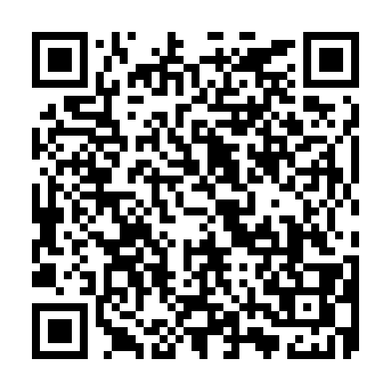
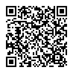

# 本書について

### 免責事項

　本作品はフィクションです。本作品に登場する人物、組織、技術、製品、法律などはすべて架空のものです。

　技術的な描写に関しては、可能な限り正確を期しております。しかし、架空の設定を前提としているため、必ずしも現実の状況に適用できるとは限りません。あくまでも、セキュリティ対策のヒントとしてご活用ください。

　当社及び著者は、読者が本書の記述内容を実践することによって生じるいかなる損害についても一切の責任を負いません。もし当社又は著者が損害賠償責任を負う場合であっても、本書一冊分の定価を限度額とします。

### 注意事項

　一般に、コンピューター等に対する攻撃行為には、刑事及び民事上の法的リスクが伴います。たとえ正当な動機であっても、技術面、法律面、倫理面で慎重さが求められます。侵入テスト等を行なう場合は、法令諸規則の遵守、管理者の承諾、利害関係者への事前説明、本番環境や外部への影響防止その他の安全措置等、充分な準備を行ってください。

　なお、本作品は、情報処理安全確保支援士の著者が、情報処理安全確保支援士業務として、「サイバーセキュリティの確保を支援する」という正当な目的のため企画し執筆したものです。決して知識の悪用はしないでください。

### 利用許諾について

　表紙及び挿絵は、CC-BY 4.0ライセンス（https://creativecommons.org/licenses/by/4.0/deed.ja）のもとに利用が許諾されています。また、本文の文章については、２０２８年１月１日よりCC-BY 4.0ライセンス（同）のもとに利用が許諾されます。

　また、これはライセンス条項ではなく、あくまでも要望ですが、作品や登場人物のイメージや品位を損ねる利用はご遠慮ください。

### 訂正等について

　本書の内容についての訂正情報、サポート情報等は以下のページに掲載されます。

https://www.kyoki-railway.co.jp/books/9784910391106/

